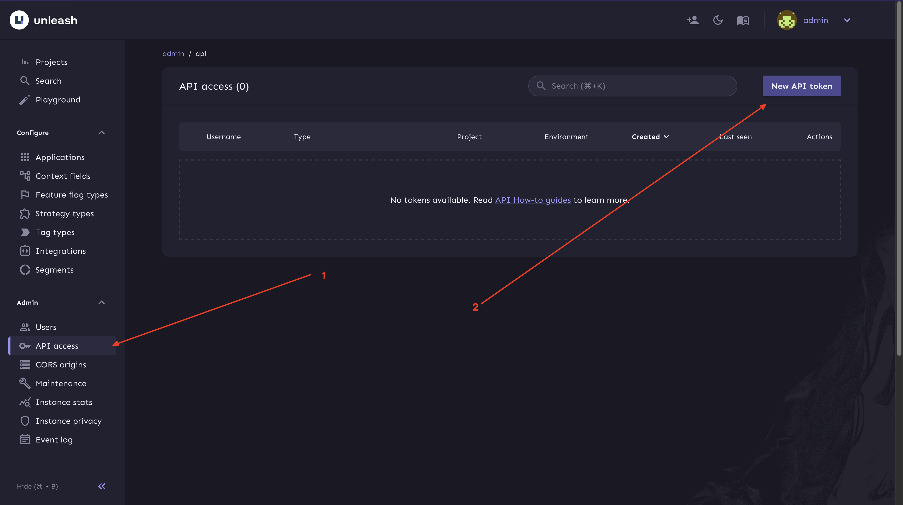
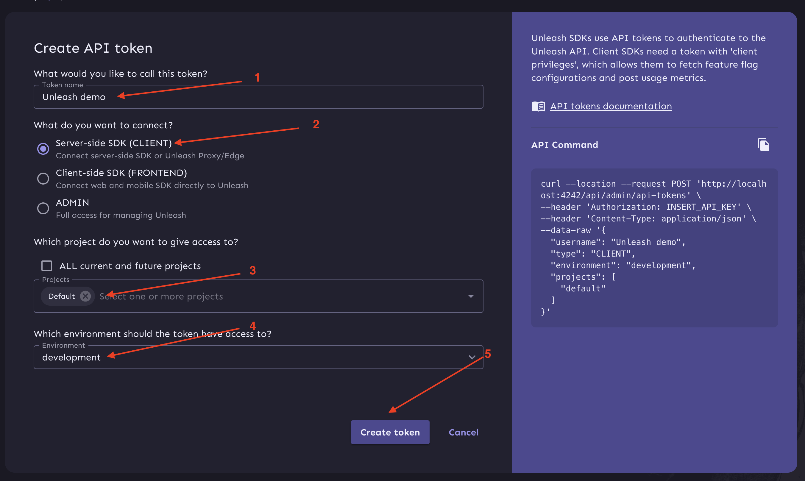
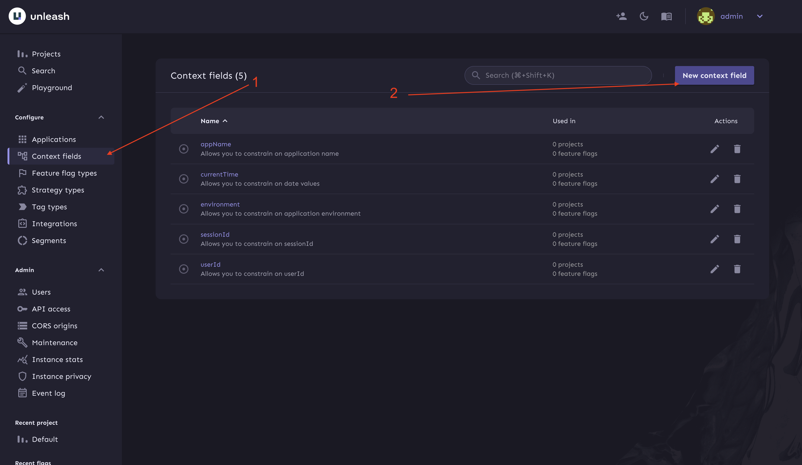
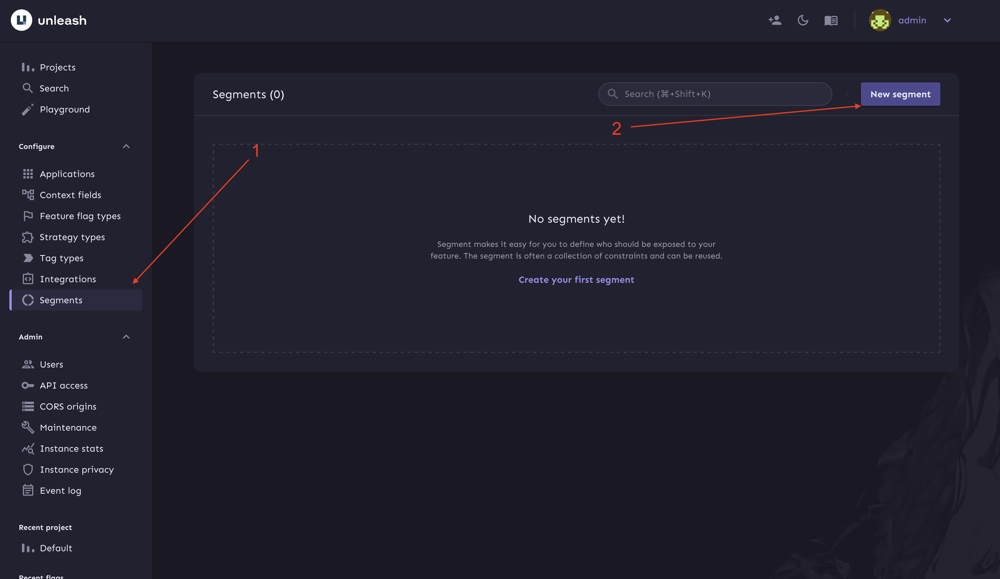
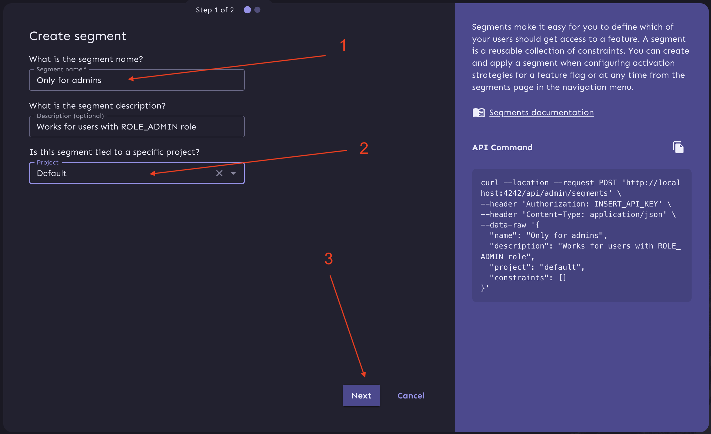
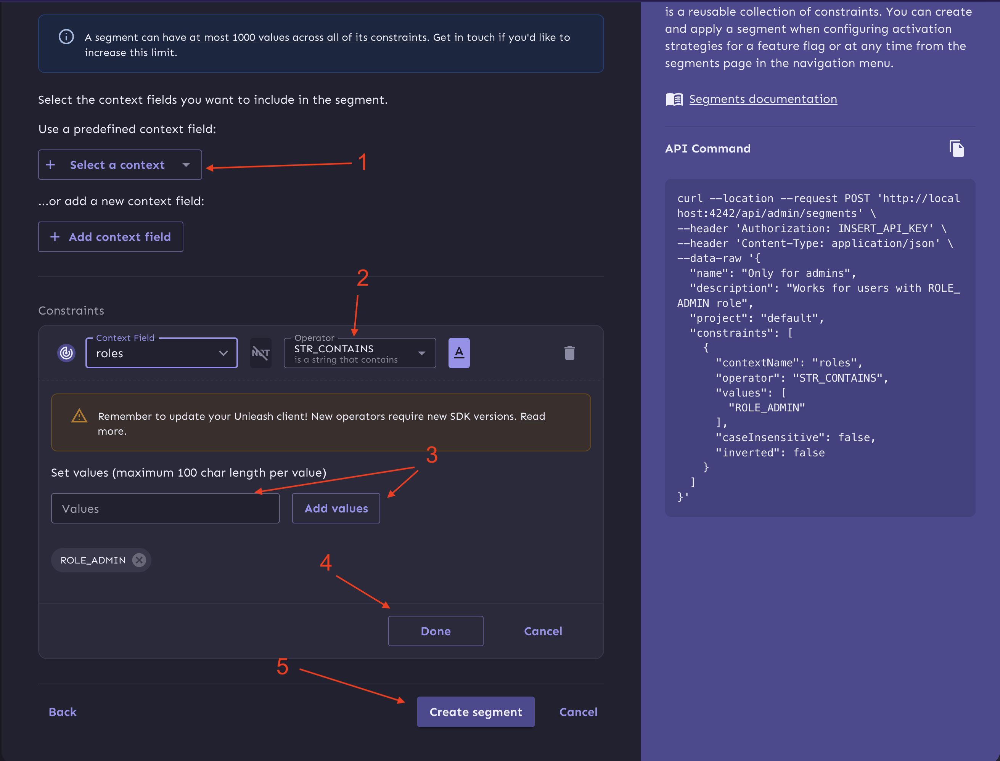
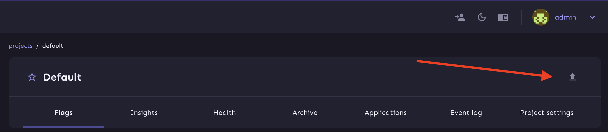
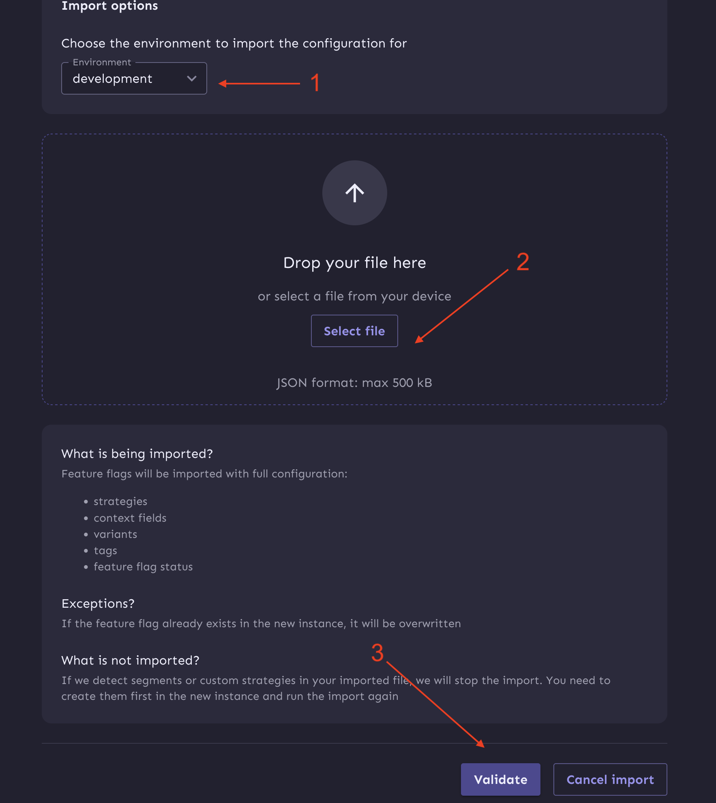
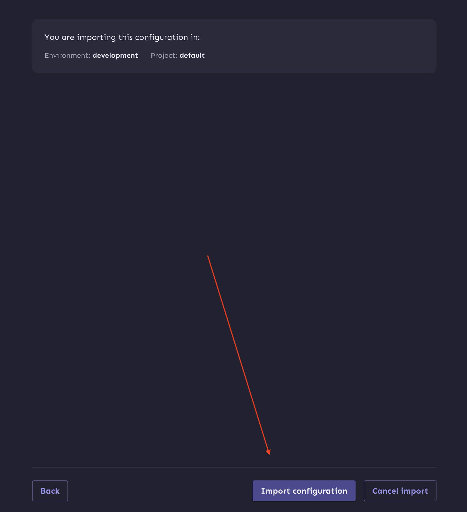

# Unleash Sandbox

This is a sandbox project that demonstrates how to use the Unleash feature toggle service in a Symfony application.

## About App Build

- **PHP:** 8.3
- **Symfony:** 7.1
- **Roadrunner:** 2024
- **Unleash:** 6
- **PostgreSQL:** 16
- **Redis:** 7.4

> **Note:** The project has been tested with the above versions. Compatibility with other versions may require additional configuration and testing.

## First Steps

1. **Clone the Repository:**
   ```bash
   git clone https://github.com/tranxton/unleash-sandbox
   cd unleash-sandbox
   ```

2. **Initialize the App:**
   Run the following command to build the app:
   ```bash
   make init
   ```

3. **Add Unleash API Tokens:**
    1. Log in to Unleash with the following credentials:
        - **Username:** `admin`
        - **Password:** `unleash4all`
    2. Navigate to the "API access" page.
    3. Click "New API token".
       
    4. Choose "Server-side API token".
    5. Select "default" project and "development" environment.
    6. Press "Create token".
       
    7. Add the created token to your `.env.local` file.

4. **Create "Only for admins" segment:**

    1. **Go to Context Fields:**
        - Navigate to the **Context fields** section in the Unleash dashboard.
        - Click on **New context field**.
       

    2. **Add Context Field:**
        - **Context name:** `roles`
        - **Description:** `Allows you to constrain on users roles`
        - Leave the other fields empty and click **Create context**.
       

    3. **Go to Segments:**
        - Navigate to the **Segments** section in the Unleash dashboard.
        - Click on **New segment**.
       

    4. **Create Segment:**
        - **Segment name:** `Only for admins`
        - **Description:** `Works for users with ROLE_ADMIN role`
        - **Project:** Select `Default`
        - Click **Next**.
       

    5. **Add Segment Constraint:**
        - Click **Select a context** and choose `roles`.
        - Set the operator to **STR_CONTAINS**.
        - Add the value `ROLE_ADMIN`.
        - Click **Add values**, then **Done**.
        - Finally, click **Create segment**.
       

5. **Import Feature Flags Dump to Unleash:**
    1. Locate the dump file in the `config/packages/unleash_client/` directory.
    2. Open the Unleash dashboard.
    3. Go to the "default" project.
    4. Click "Import".
       
    5. Select the "development" environment, choose the dump file, and click "Validate".
       
    6. Click "Import".
       

6. **Your Project is Ready to Use!**

## File Structure Overview

The following is a brief overview of the key directories and files in this project:

```plaintext
unleash-sandbox/
│
├── config/
│   └── packages/
│       └── unleash_client/
│           └── bootstrap.json         # Feature flags dump file
│           └── unleash_client.json    # Configuration for Unleash SDK
│
├── src/
│   └── Controller/                    # Symfony controllers with examples of using feature flags
│
├── templates/
│   └── feature-toggle/                # Symfony twig templates with examples of using feature flags
│
├── Makefile                           # Makefile for common tasks
└── README.md                          # Project documentation
```

## Code Samples

### Checking Feature Flag Status

You can check the status of a feature flag using the following Symfony console command:

```bash
bin/console unleash:test-flag your-flag-name
```

### Example Usage in Controllers and Twig-templates

Example of using a feature flag in a Symfony controller you can find in `src/Controller/FeatureToggle` 
and `templates/feature-toggle` directories.

## URLs

### Application URLs

- **App:** [http://localhost:8080](http://localhost:8080)
- **Unleash:** [http://localhost:4242](http://localhost:4242)

### List of App URLs

#### Authorization

- **Login:** [/login](http://localhost:8080/login) - Login page
- **Logout:** [/logout](http://localhost:8080/logout) - Logout page

#### Feature Flags

- **default-feature-flag:** [/feature-toggle/default](http://localhost:8080/feature-toggle/default)
- **attribute-feature-flag:** [/feature-toggle/attribute](http://localhost:8080/feature-toggle/attribute)
- **twig-feature-flag:** [/feature-toggle/twig](http://localhost:8080/feature-toggle/twig)
- **kill-switch-flag:** [/feature-flag/kill-switch](http://localhost:8080/feature-flag/kill-switch)
- **stale-feature-flag:** [/feature-toggle/stale](http://localhost:8080/feature-toggle/stale)
- **admin-feature-flag:** [/feature-toggle/auth/role-any](http://localhost:8080/feature-toggle/auth/role-any)

## Predefined Users

### Users

- `user1@example.com` - Password: `user1@example.com`
- `user2@example.com` - Password: `user2@example.com`
- `user3@example.com` - Password: `user3@example.com`
- `user4@example.com` - Password: `user4@example.com`
- `user5@example.com` - Password: `user5@example.com`
- `user6@example.com` - Password: `user6@example.com`
- `user7@example.com` - Password: `user7@example.com`
- `user8@example.com` - Password: `user8@example.com`

### Admins

- `user9@example.com` - Password: `user9@example.com`
- `user10@example.com` - Password: `user10@example.com`

### Further Help

If you encounter issues not covered here, consider checking the following resources:
- [Unleash Documentation](https://docs.getunleash.io/)
- [Symfony Documentation](https://symfony.com/doc/current/index.html)
- [Unleash SDK Documentation](https://docs.getunleash.io/reference/sdks/php)
- [Unleash Symfony Bundle Documentation](https://github.com/Unleash/unleash-client-symfony)

---