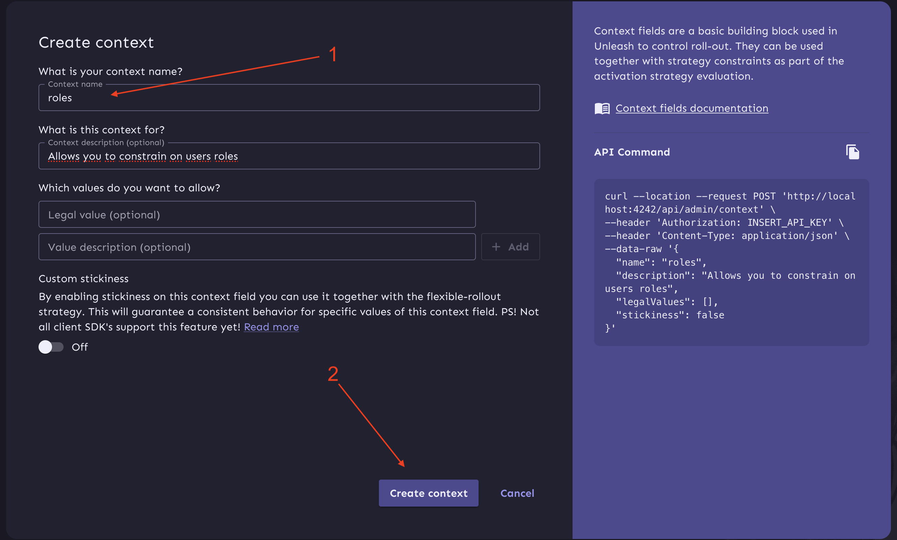

## Table of Contents

1. [Unleash Sandbox](#unleash-sandbox)
2. [Pre-requisites](#pre-requisites)
3. [About App Build](#about-app-build)
4. [Credentials](#credentials)
    - [Unleash](#unleash)
    - [Grafana](#grafana)
    - [Prometheus](#prometheus)
5. [First Steps](#first-steps)
    1. [Clone the Repository](#1-clone-the-repository)
    2. [Initialize the App](#2-initialize-the-app)
    3. [Prepare the App for Development or Production](#3-prepare-the-app-for-development-or-production)
    4. [Add Unleash API Tokens](#4-add-unleash-api-tokens)
    5. [Create "Only for admins" segment](#5-create-only-for-admins-segment)
    6. [Import Feature Flags Dump to Unleash](#6-import-feature-flags-dump-to-unleash)
    7. [Your Project is Ready to Use](#7-your-project-is-ready-to-use)
6. [File Structure Overview](#file-structure-overview)
7. [Code Samples](#code-samples)
8. [URLs](#urls)
9. [Predefined Users](#predefined-users)
10. [Testing](#testing)
    - [Simple Postman Testing](#1-simple-postman-testing)
    - [Performance Testing with K6](#2-performance-testing-with-k6)
11. [Further Help](#further-help)

# Unleash Sandbox

This is a sandbox project that demonstrates how to use the Unleash feature toggle service in a Symfony application

## Pre-requisites

Before running the application, ensure the following tools and services are installed on your machine:

1. **Docker & Docker Compose**
2. **Makefile** is required for running automated tasks.
3. **Postman** is used for testing and reviewing Unleash API endpoints.

## About App Build

- **PHP:** 8.3
- **Symfony:** 7.1
- **Roadrunner:** 2024
- **Unleash:** 6
- **PostgreSQL:** 16
- **Redis:** 7.4
- **Prometheus:** 3
- **Grafana:** 11.3.1
- **Grafana-K6:** 0.55

> **Note:** The project has been tested with the above versions. Compatibility with other versions may require additional configuration and testing.

## Credentials

### Unleash
Access the Unleash interface using the following credentials:

- **URL**: [http://127.0.0.1:4242](http://127.0.0.1:4242)
- **Username**: `admin`
- **Password**: `unleash4all`

### Grafana
Access the Grafana dashboard using the following credentials:

- **URL**: [http://127.0.0.1:3000](http://127.0.0.1:3000)
- **Username**: `admin`
- **Password**: `admin`

### Prometheus
Access the Prometheus storage:

- **URL**: [http://localhost:9090](http://localhost:9090)

## First Steps

### 1. Clone the Repository:
   ```bash
   git clone https://github.com/tranxton/unleash-sandbox
   cd unleash-sandbox
   ```

### 2. Initialize the App:
   Run the following command to build the app:
   ```bash
   make init
   ```

### 3. Prepare the App for Development or Production

You can configure the app environment for either development or production using the following Makefile targets:

#### For Development
Use this command to prepare the application for development:

```bash
make app.build.dev
```

#### For Production

Use this command to prepare the application for production:

```bash
make app.build.prod
```

### 4. Add Unleash API Tokens:

1. Log in to Unleash with the following credentials:
2. Navigate to the "API access" page.
3. Click "New API token".
   
4. Choose "Server-side API token".
5. Select "default" project and "development" environment.
6. Press "Create token".
   
7. Add the created token to your `.env.local` file.

### 5. Create "Only for admins" segment:

~~1. **Go to Context Fields:**
    - Navigate to the **Context fields** section in the Unleash dashboard.
    - Click on **New context field**.
   

2. **Add Context Field:**
    - **Context name:** `roles`
    - **Description:** `Allows you to constrain on users roles`
    - Leave the other fields empty and click **Create context**.
   

3. **Go to Segments:**
    - Navigate to the **Segments** section in the Unleash dashboard.
    - Click on **New segment**.
   

4. **Create Segment:**
    - **Segment name:** `Only for admins`
    - **Description:** `Works for users with ROLE_ADMIN role`
    - **Project:** Select `Default`
    - Click **Next**.
   

5. **Add Segment Constraint:**
    - Click **Select a context** and choose `roles`.
    - Set the operator to **STR_CONTAINS**.
    - Add the value `ROLE_ADMIN`.
    - Click **Add values**, then **Done**.
    - Finally, click **Create segment**.
   

### 6. Import Feature Flags Dump to Unleash:
1. Locate the dump file in the `config/packages/unleash_client/` directory.
2. Open the Unleash dashboard.
3. Go to the "default" project.
4. Click "Import".
   
5. Select the "development" environment, choose the dump file, and click "Validate".
   
6. Click "Import".
   

### 7. Your Project is Ready to Use!

## File Structure Overview

The following is a brief overview of the key directories and files in this project:

```plaintext
unleash-sandbox/
│
├── benchmarks/
│   └── reports/                                       # Contains benchmark reports for Unleash performance
│
├── config/
│   └── packages/
│       └── unleash_client/
│           └── 10_exported_feature_flags.json         # Example export of 10 feature flags
│           └── 500_exported_feature_flags_part_1.json # Part 1 of a larger export containing 500 feature flags
│           └── 500_exported_feature_flags_part_2.json # Part 2 of a larger export containing 500 feature flags
│
├── docker/
│   └── prometheus/
│       └── config.yaml                                # Prometheus configuration for scraping metrics from RoadRunner
│                
├── postman/                
│   └── App.postman_collection.json                    # Postman collection for testing application APIs
│   └── Unleash.postman_collection.json                # Postman collection for reviewing and testing Unleash API
│                
├── src/                
│   └── Controller/                                    # Symfony controllers with examples of using feature flags
│                
├── templates/                
│   └── feature-toggle/                                # Symfony twig templates with examples of using feature flags
│                
├── Makefile                                           # Makefile for common tasks
└── README.md                                          # Project documentation
```

## Code Samples

### Checking Feature Flag Status

You can check the status of a feature flag using the following Symfony console command:

```bash
bin/console unleash:test-flag your-flag-name
```

### Example Usage in Controllers and Twig-templates

Example of using a feature flag in a Symfony controller you can find in `src/Controller/FeatureToggle` 
and `templates/feature-toggle` directories.

## URLs

### List of App URLs

#### Authorization

- **Login:** [/login](http://localhost:8080/login) - Login page
- **Logout:** [/logout](http://localhost:8080/logout) - Logout page

#### Feature Flags

- **default-feature-flag:** [/feature-toggle/default](http://localhost:8080/feature-toggle/default)
- **attribute-feature-flag:** [/feature-toggle/attribute](http://localhost:8080/feature-toggle/attribute)
- **twig-feature-flag:** [/feature-toggle/twig](http://localhost:8080/feature-toggle/twig)
- **kill-switch-flag:** [/feature-flag/kill-switch](http://localhost:8080/feature-flag/kill-switch)
- **stale-feature-flag:** [/feature-toggle/stale](http://localhost:8080/feature-toggle/stale)
- **admin-feature-flag:** [/feature-toggle/auth/role-any](http://localhost:8080/feature-toggle/auth/role-any)

## Predefined Users

### Users

- `user1@example.com` - Password: `user1@example.com`
- `user2@example.com` - Password: `user2@example.com`
- `user3@example.com` - Password: `user3@example.com`
- `user4@example.com` - Password: `user4@example.com`
- `user5@example.com` - Password: `user5@example.com`
- `user6@example.com` - Password: `user6@example.com`
- `user7@example.com` - Password: `user7@example.com`
- `user8@example.com` - Password: `user8@example.com`

### Admins

- `user9@example.com` - Password: `user9@example.com`
- `user10@example.com` - Password: `user10@example.com`

## Testing

There are two ways to run tests in this project:

### 1. Simple Postman Testing
- Use the **Postman collection** located in the `postman/` directory to perform basic API testing.
    - `App.postman_collection.json`: For testing application APIs.
    - `Unleash.postman_collection.json`: For reviewing and testing Unleash APIs.
- Import the collections into Postman, configure collection variables, and execute the predefined requests.

### 2. Performance Testing with K6
- For advanced performance testing, use **K6** to generate load and monitor application behavior.
- **Test Scripts Location**:
    - All test scripts for K6 must be stored in the `benchmarks/k6` directory.
    - Example file path: `benchmarks/k6/example.js`.
    - K6 will execute these scripts to simulate load and capture metrics.

- **Metrics Collection with Prometheus**:
    - Prometheus scrapes metrics from the RoadRunner server, configured via `docker/prometheus/config.yaml`.
    - K6 metrics are sent to Prometheus using the `K6_PROMETHEUS_RW_SERVER_URL` environment variable.

- **Visualization in Grafana**:
    - Use Grafana to create dashboards for visualizing performance metrics, such as request duration, error rates, and throughput.
    - The `docker-compose.yml` includes Grafana pre-configured to work with Prometheus for easy setup.

### Docker-Compose Setup
The provided `docker-compose.yml` includes the following tools for testing:
- **Grafana**: For visualizing metrics in a customizable dashboard.
- **Prometheus**: For scraping and storing application metrics from RoadRunner.
- **K6**: A load testing tool for generating traffic and analyzing system performance.

### Running an Example Test
- To run a specific test script, use the following command:
  ```bash
  docker-compose run k6 run /app/example.js
  ```

## Further Help

If you encounter issues not covered here, consider checking the following resources:
- [Unleash Documentation](https://docs.getunleash.io/)
- [Symfony Documentation](https://symfony.com/doc/current/index.html)
- [Unleash SDK Documentation](https://docs.getunleash.io/reference/sdks/php)
- [Unleash Symfony Bundle Documentation](https://github.com/Unleash/unleash-client-symfony)
- [Grafana K6 documentation](https://grafana.com/docs/k6/latest/using-k6/)
